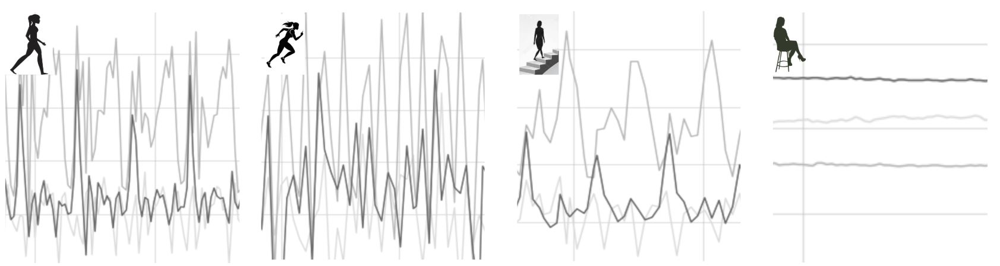

# WIP: Human Activity Recognition (HAR) Using Neural Networks

## 1. Business Understanding
Human activity recognition (HAR) has applications in a wide range of areas. In healthcare and rehabilitation, HAR can help the activity levels of indivudals and elderly adults, detect falls or identify unusual patterns that may indicate health issues. Within the wearable technology sector, fitness and sports, it can help classify activities to calculate metrics such as calories or sleep quality index. 

This project focuses on HAR using [data](https://www.cis.fordham.edu/wisdm/dataset.php) collected by the Wireless Sensor Data Mining (WISDM) Lab. The dataset includes labeled accelerometer data from **29 users** as they perform **six different daily activities**: *walking, jogging, ascending/descending stairs, sitting and standing*. The interested reader is referred to [Kwapisz et al., 2010](https://www.cis.fordham.edu/wisdm/includes/files/sensorKDD-2010.pdf) for more information on the methods of data collection and the primary classification methods used. In the original work, 43 features were extracted from the time series data and three classification methods (decision trees, logistic regression and multilayer perceptron) were used to classify the activities. None of the three outperformed the other two in terms of accuracy for all activity categories. However, the multilayer perceptron did the best overall. It was shown that all algorithms struggle to distinguish ascending stairs from descending stairs such that if the two are combined into one one type of activity, the performance of all algorithms improve. 

This work first reproduces the results of [Kwapisz et al., 2010](https://www.cis.fordham.edu/wisdm/includes/files/sensorKDD-2010.pdf) for one of the conventional classification methods they studied. We will then show that we can improve the accuracy of HAR algorithm by using neural networks. 
## 2. Data Understanding and Analysis
There are two sets of data involved in this study:
### 2.1. Raw time-series data

This is the raw data set. The data has **1098208 entries** and **3 features** (the three acceleration components). The **sampling frequency** is **20 Hz** (see Fig.1 for a 5-second sample).

*Figure 1.* A 10-second sample of time-series data for the activity of *walking* recorded for a subject.

The data is imbalanced - ranging from 38% in the walking category while only 4% in the standing category (see Fig. 2). We need to balance the data before using it for training a neural networks model.

*Figure 2.* Normalized distribution of raw accelerometer data among classes. 

We will use the raw time-series dataset to train a one-dimensional Convolutional Neural Network (1-D CNN) model.

### 2.2. Transformed (feature-engineered) data

The authors of the original paper [Kwapisz et al., 2010](https://www.cis.fordham.edu/wisdm/includes/files/sensorKDD-2010.pdf) used the raw data set to extract relevant temporal characteristics of the signals in 10-second windows through feature extraction techniques. This was necessary since classical classification models (such as logistic regression) cannot be trained on raw time-series data. This transformed data set consists of **~5000** entries and **43 features**. 

In this work, the transformed data set is used to reproduce the work of the authors for a baseline logistic regression model. 

## 3. Machine Learning Models
In this section, we explain the modeling procedure for the baseline logistic regression model as well as the neural networks model. 

### 3.1. Benchmark logistic regression model
We use the feature-engineered data to train and cross-validate a multinomial logistic regression model to reproduce the authors' work in the original paper. Since we have class imbalance, we use the weighted average F1-score as the evaluation metric. The model has a weighted F1-score of 0.7. 

### 3.2. 1-D CNN model

*Figure 1.* Diagram showing the pipeline for building and training the 1d-CNN model.

## 3. Results and Recommendations
- We have built and trained a 1D-CNN model that can perform activity recognition in six categorites (walking, jogging, sitting, standing, going up and down the stairs) given raw accelerometer data. The overall cross-validated accuracy of the model is 81%. Accuracy on unseen test data is 84%. The weighted average F1-score is also 83%.

- The model was developed with minimal data preprocessing and/or hectic feature extraction. This is an advantage over classical classification models where time series data has to go through extensive and time-consuming feature extraction processes before it can be used as training data for the model. 
- The model's performance (weighted F1-score) improved from that of the logistic regression model reproduced at the beginning of the work by 13% (83% for 1d-cnn vs. 70% for logistic regression). Given that minimal feature engineering was required to develop this model, we can conclude that it's the better model to consider deploying (unless a smaller-footprint model at considerably lower accuracy is preferred). 
- The fact that a simple logistic regression model is able to have a decent performance considering a complex task such as activity recognition, proves that we should always start with simpler, more interpretable models and only move to more complex ones when they cannot get to the performance level we desire.
- The confusion matrix shows that upstairs activity is the one most misclassified. The model confuses upstairs and downstairs activities. This is expected since the periodicity of the two activities are on-par when the raw time signals are considered. This is also observed and recorded in the original paper. The authors show that considering the two activities as one bucket/class imrpoves the performance of the model considerably. We can expect a similar result here.
- 5-fold cross validation took about 10 minutes. Training the final model on all of the training set took about 4 minutes. Inference (evaluation) on the whole of test set (3449 entries) took about 0.6 sec, therefore we can assume the average inference time for the model is ~0.2 ms.

## 4. Limitations and Next Steps
- To imrpove the performance of the model further, one can consider unifying some of the classes that have similarly inherent temporal properties (such as sitting and standing or as it was mentioned in the previous section, climbing up and down stairs). This is expected to improve the performance of the model due to two reasons: (1) It is well established that as the number of classes increase, the model will need more training data to do a good job at classification. Reducing the number of classes will reduce the amount of data needed for the model to perform ideally (not overfit) such that the present amount of data may be more ideal. (2) Combining buckets for classes that have similar inherent temporal patterns will make the model struggle less to distinguish between them, improving accuracy across classes.
- The model is a general-population model and is not personalized. Therefore, it is expected to underperform for individuals whose footstep pace is not close to average as well as individuals who may have difficulty climbing up and down the stairs (e.g. seniors). It may be worth to cluster the population first based on walking/jogging pace, average ascent/descent times, age, and gender. If distinct clustering patterns emerge, a separate model can be built and trained for each population segment.

## 5. Resources
- Data:
- Jupyter Notebook:
- Presentation:

## 6. Navigating the Repository

